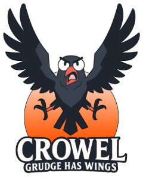

# EKİP: GAAK CREW-36
## EKİP ÜYELERİ

| İSİM | SORUMLULUK | 
|:----------|:----------|
| Seray Keskinkılınç | Developer |
| Yunus Emre Akyay | Developer |
| Beste Bozkurt | Scrum Master, Product Owner |

  

# OYUN TASARISI (PROPOSAL) 
## [OYUNUN ADI] CROWEL: Grudge Has Wings
## [PROLOGUE]

Kargalar asla unutmaz. 
 
Kaybedilmiş bir yuvanın yankısı, 
 
Kanatlı bir kin olarak yaşar 
 
Ve nihayetinde sana intikam olarak geri döner. 
 
 
Kargalar asla unutmaz, ama bekler.
 
Doğru anı, doğru fırsatı…
 
Ve hiç beklemediğin bir anda,
 
Seninle tekrar yüzleşecektir.
 
O seni bulduğunda ise yapabileceğin tek şey…
 
Kaçabildiğin kadar uzağa kaçmaktır.

## PROPOSAL LINK 
[Proposal Report Doc](https://docs.google.com/document/d/1wEjlsZ3QrWh5ra1cclZY_XKK97Q9MIzxCxA_48bxnAU/edit?usp=sharing)

## [OYUN AÇIKLAMASI]

CROWEL: Grudge Has Wings, bir 3D stealth-strategy aksiyon oyunu olarak oyuncularını otel uğruna yuvası tahrip edilmiş bir karganın eşsiz intikam macerasına davet eder. Uğruna evinizin yok edildiği bu otelde kimseyi barındırmamak, stratejik saldırılar ve tuzaklar planlayarak kısıtlı sürede herkesin tatilini berbat edip otelden kaçırmak temel amacınızdır.

## [OYUN ÖZELLİKLERİ]
+ 3D
+ stealth-strategy aksiyon
+ Tek oyunculu
+ Low-poly
## [HEDEF KİTLESİ]
+ bağımsız (indie) oyun severler 
+ hayvan protagonist severler
+ strateji ve intikam teması severler
+ 13 yaş ve üzeri

## [BACKLOG URL]
[Team36 Miro Backlog Board](https://miro.com/app/board/uXjVIjIWxhI=/)

  

# SPRINT.1

## [SPRINT NOTLARI]
+ Sprint planlaması esnasında her sprint için ana hedef konulması ve hedefler doğrultusunda sprint için görev listesinin oluşturulmasına karar verilmiştir.
+ İlk takım toplantılarında takım üyelerinin tasarım ve kodlama alanlarında yetkinlik dereceleri üzerine konuşulmuş ve buna göre görev dağılımı yapılması düşünülmüştür. Fakat ilk sprint için ekipte henüz net alt gruplar oluşturulmamış ve bunun doğal bir şekilde oluşması amacıyla bu sprintin ekibin beraber çalışması ve ortaya çıkarılan işlerin anlaşılması açısından bir deneme olmasına karar verilmiştir.
+ Sprint review ve retrospective toplantısının 07.07.2025 Pazartesi tarihinde yapılması planlanmıştır.
## [SPRINT İÇİNDE TAMAMLANMASI HEDEFLENEN PUAN]
+ Sprint 1 için tamamlanması hedeflenen puan 28 olarak belirlenmiştir.
## [PUAN TAMAMLAMA MANTIĞI]
+ Görevler (To-Do) listelendikten sonra hepsine kolaydan zora doğru 1, 2 ve 3 şeklinde rakamlar atanmıştır ve bu rakamlar tüm görevler için zorluk ifade eden birer "tag" haline gelmiştir.
+ Görevlere verilen "tag"lerin toplamı, sprint içerisinde tamamlanması hedeflenen puana dönüşmüştür.
## [DAILY SCRUM]
+ Görüşmeler çoğunlukla Whatsapp üzerinden yapılmıştır.
+ Gerekli durumlarda Slack takım kanalımızda huddle toplantıları düzenlenmiştir.
+ [Daily Scrum Messages via Drive](https://drive.google.com/drive/u/0/folders/10LfuCgrbaLYTVLfsbcvQqqjbHifXQap7)

## [SPRINT BOARD UPDATE]
Sprint 1 Miro Board Screenshot
+ 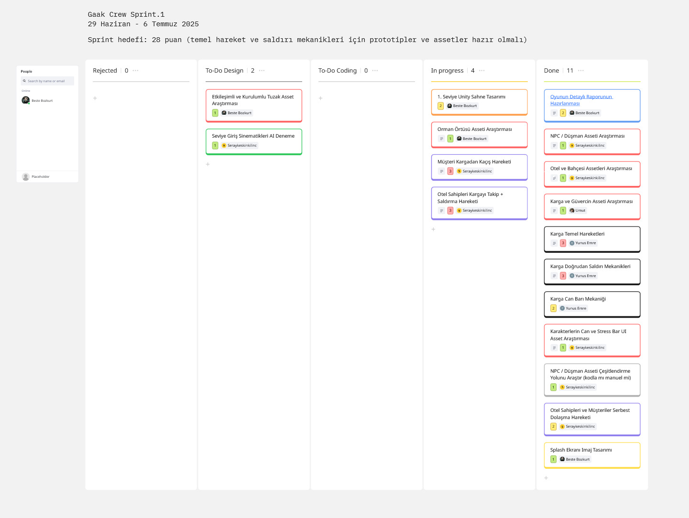
## [ÜRÜN DURUMU]
+ 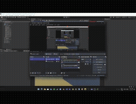
+ 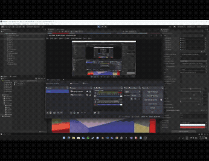
+ 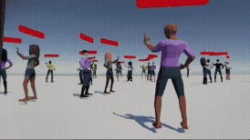
+ 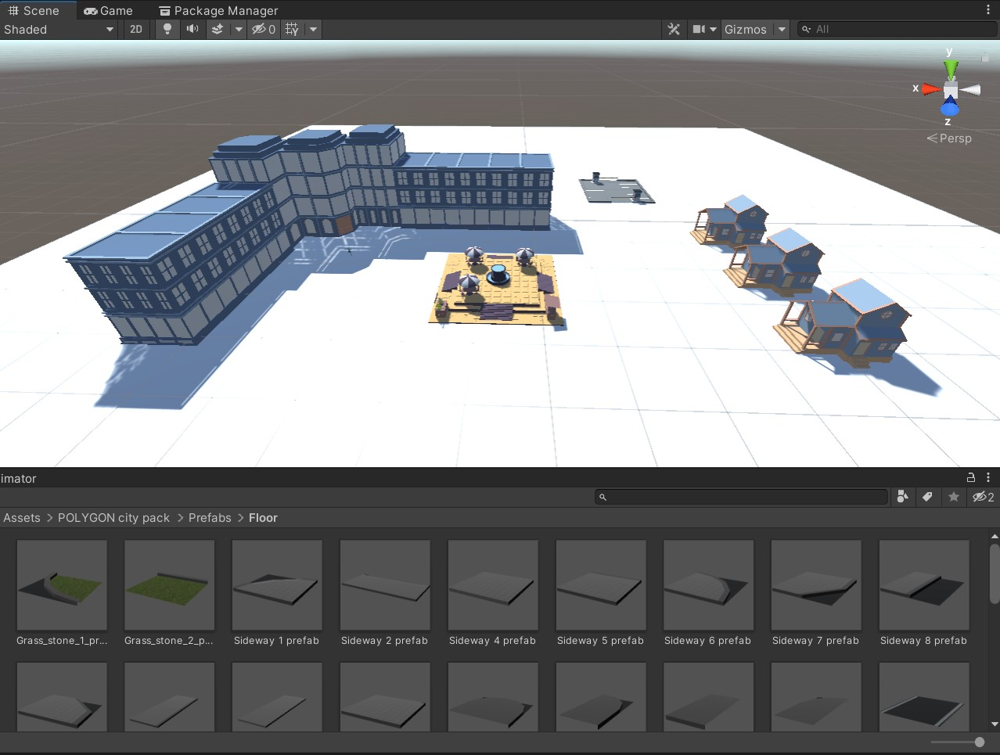
## [SPRINT REVIEW]
Toplantı katılımcıları: Seray Keskinkılınç, Yunus Emre Akyay, Umut Başar, Beste Bozkurt
+ Ekibimiz sprint için hedeflenen görevlerin büyük bir çoğunluğunu tamamlamış ve "temel hareket ve saldırı mekanikleri için prototipler ve assetler hazır olmalı" şeklinde ifade edilen sprint hedefine ulaşmıştır.
+ Sprint sonunda ekip üyelerinden biri projeden ayrıldı. Sprint sürecini doğrudan etkilemese de ilerleyen planlamalarda dikkate alınması gereken bir gelişme oldu.

## [SPRINT RETROSPECTIVE]
Toplantı katılımcıları: Seray Keskinkılınç, Yunus Emre Akyay, Umut Başar, Beste Bozkurt
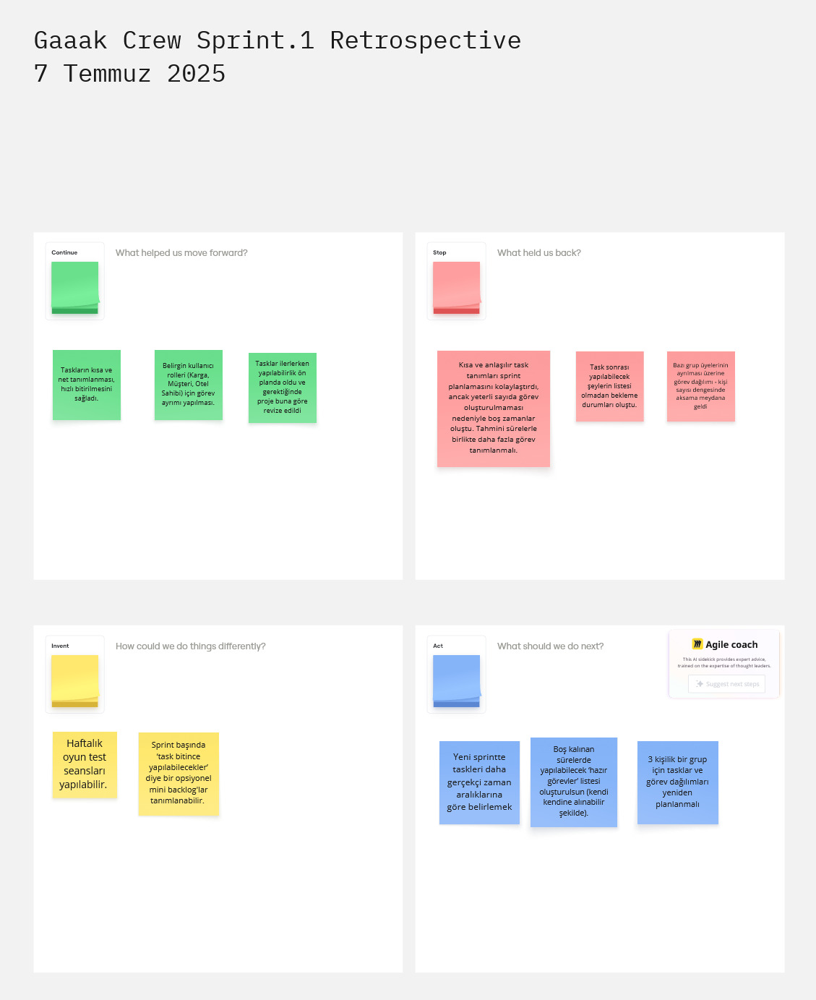

### Continue
+ Task'ların kısa ve net bir şekilde tanımlanması, hızlı bitirilmelerini sağladı.
+ Belirgin kullanıcı rolleri (Karga, Müşteri, Otel Sahibi) için görev ayrımlarının yapılması planlamayı kolaylaştırdı.

### Stop
+ Kısa ve net task tanımlamaları planlamayı kolaylaştırsa da yeterli sayıda task oluşturulmaması nedeniyle sprint içerisinde boş zamanlar oluştu.
+ Bazı grup üyelerinin ayrılması üzerine görev dağılımı-kişi sayısı dengesinde aksama meydana geldi.

### Invent
+ Haftalık 1-2 defa oyun test seansları düzenlenebilir.
+ Sprint başında görevlerini erken bitiren kişilerin devam edebileceği bir "task bitince yapılabilecekler" listesi tanımlanabilir. 

### Act
+ Yeni sprint'te görevler daha gerçekçi süre tahminleriyle planlanacak.
+ Boş zamanlar için kullanılabilecek bir "task bitince yapılabilecekler" listesi oluşturulacak.

  

# SPRINT.2

## [SPRINT NOTLARI]
+ Backlog düzenimizde her task için detaylar ve açıklamalar "card details" kısmında yer almaktadır.
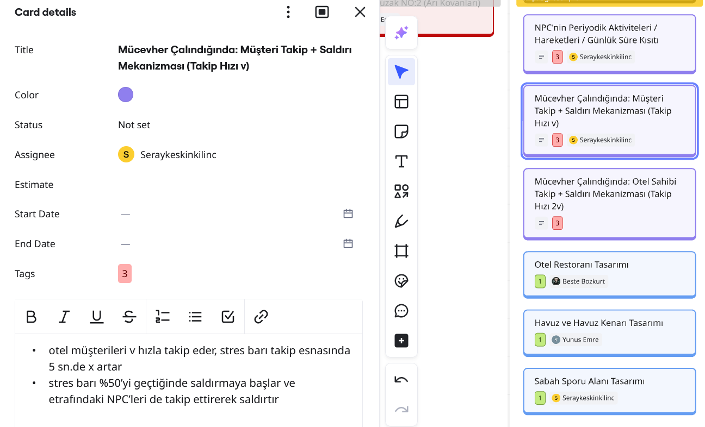
+ Sprint review ve retrospective toplantısının 20.07.2025 Pazar tarihinde yapılması planlanmıştır.
+ Sprint başlangıcında takımdan bir kişinin daha ayrılması sonucu güncel ekip üyeleri toplam 3 kişiye düşmüştür.

## [SPRINT İÇİNDE TAMAMLANMASI HEDEFLENEN PUAN]
+ Sprint 2 için tamamlanması hedeflenen puan 38 olarak belirlenmiştir.

## [PUAN TAMAMLAMA MANTIĞI]
+ Görevler (To-Do) listelendikten sonra hepsine kolaydan zora doğru 1, 2 ve 3 şeklinde rakamlar atanmıştır ve bu rakamlar tüm görevler için zorluk ifade eden birer "tag" haline gelmiştir.
+ Görevlere verilen "tag"lerin toplamı, sprint içerisinde tamamlanması hedeflenen puana dönüşmüştür.

## [DAILY SCRUM]
+ Görüşmeler çoğunlukla Whatsapp üzerinden yapılmıştır.
+ Gerekli durumlarda Slack takım kanalımızda huddle toplantıları düzenlenmiştir.
+ [Daily Scrum Messages via Drive](https://drive.google.com/drive/u/0/folders/10LfuCgrbaLYTVLfsbcvQqqjbHifXQap7)

## [SPRINT BOARD UPDATE]
Sprint 2 Miro Board Screenshot
+ 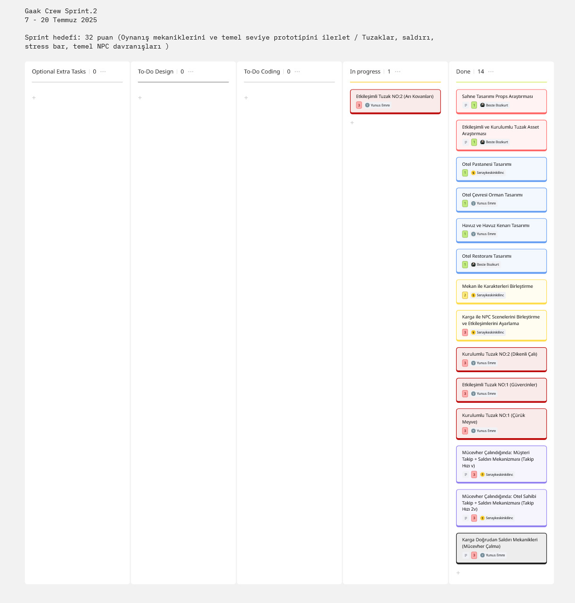

## [ÜRÜN DURUMU]
+ 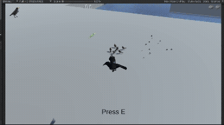
+ 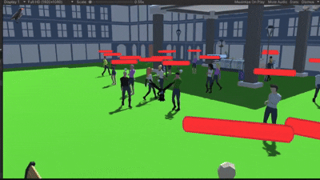
+ 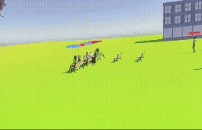
+ 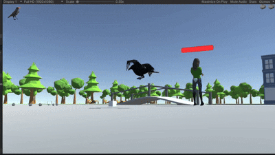
+ 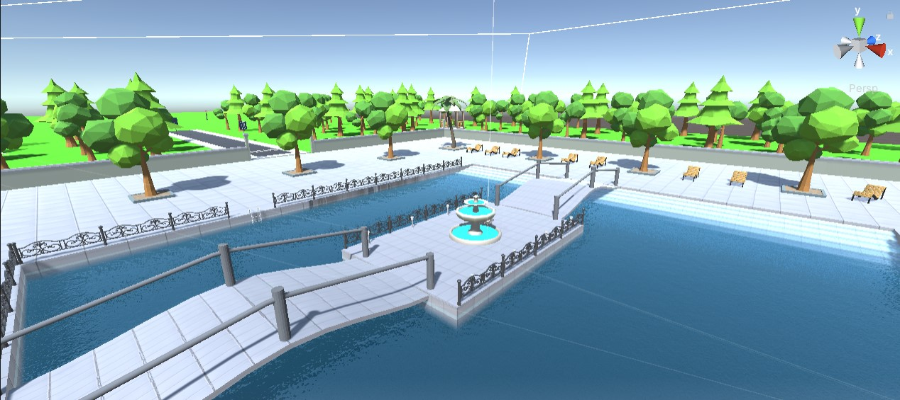
+ 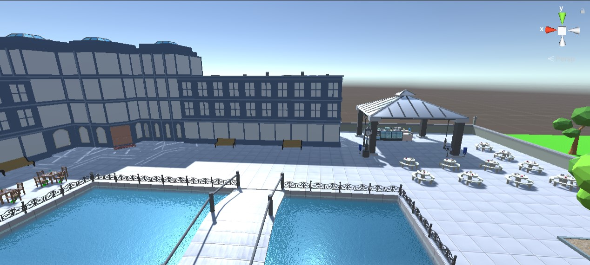
+ 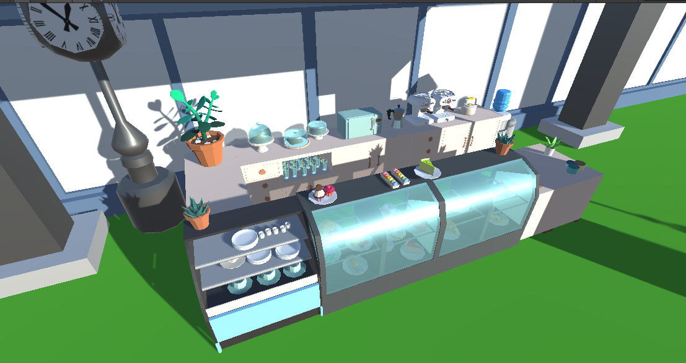

## [SPRINT REVIEW]
Toplantı katılımcıları: Seray Keskinkılınç, Yunus Emre Akyay, Beste Bozkurt

+ Bu sprint takımın birinci sprintte prototiplerini oluşturduğu temel mekanikleri geliştirmesi ve detaylandırması şeklinde ilerlemiştir.
+ Tuzak sistemleri, saldırı mekanikleri, temel ana karakter ve NPC davranış mekanikleri bu sprintte oturtulmuş ve seviye akışı üzerinde çalışılmıştır.
+ Bazı tuzak mekaniklerinde yapılabilirlik üzerinden değişiklik ve güncellemeler yapılmıştır. (Ex. Su tuzağı çürük meyve tuzağına dönüştü)
+ Takımda developer rolünde Yunus Emre ve Seray ön plana çıkarken product owner rolünü Beste üstlenmektedir. Tasarım kısmına herkes katkıda bulunmaktadır.
+ Önceki Sprint Retrospective yorumlarımız üzerine Miro tablomuzda "Rejected" kolonu çıkarılarak yerine "Optional Extra Tasks" kolonu eklenmiştir. Her opsiyonel ekstra task yapılabildiği takdirde sprint hedef puanına +3 puan olarak yansır.

## [SPRINT RETROSPECTIVE]
Toplantı katılımcıları: Seray Keskinkılınç, Yunus Emre Akyay, Beste Bozkurt
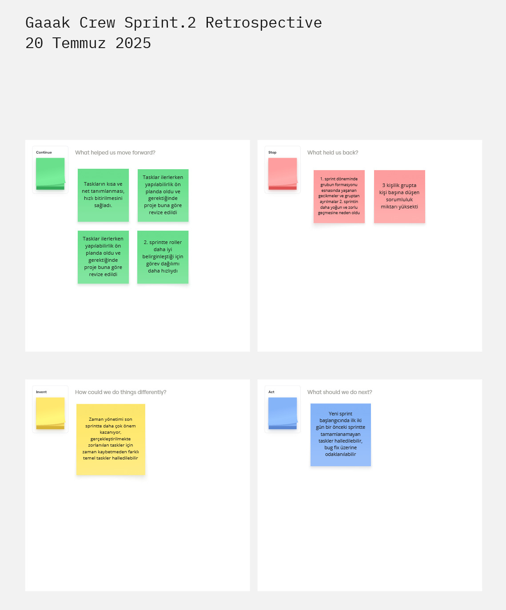

### Continue
+ Taskların kısa ve net tanımlanması, hızlı bitirilmesini sağladı.
+ Tasklar ilerlerken yapılabilirlik ön planda oldu ve gerektiğinde proje buna göre revize edildi.
+ Sprint 2'de roller daha iyi belirginleştiği için görev dağılımı daha hızlıydı.
   
### Stop
+ Sprint 1 döneminde grubun formasyonu esnasında yaşanan gecikmeler ve gruptan ayrılmalar 2. sprintin daha yoğun ve zorlu geçmesine neden oldu.
+ 3 kişilik grupta kişi başına düşen sorumluluk miktarı yüksekti.
  
### Invent
+ Zaman yönetimi son sprintte daha çok önem kazanıyor, gerçekleştirilmekte zorlanılan taskler için zaman kaybetmeden farklı temel taskler halledilebilir.
  
### Act
+ Yeni sprint başlangıcında ilk iki gün bir önceki sprintte tamamlanamayan taskler halledilebilir, bug fix üzerine odaklanılabilir

  

# SPRINT.3

## [SPRINT NOTLARI]
+ Sprint review ve retrospective toplantısının 03.08.2025 Pazar tarihinde yapılması planlanmıştır.

## [SPRINT İÇİNDE TAMAMLANMASI HEDEFLENEN PUAN]
+ Sprint 3 için tamamlanması hedeflenen puan 33 olarak belirlenmiştir.

## [PUAN TAMAMLAMA MANTIĞI]
+ Görevler (To-Do) listelendikten sonra hepsine kolaydan zora doğru 1, 2 ve 3 şeklinde rakamlar atanmıştır ve bu rakamlar tüm görevler için zorluk ifade eden birer "tag" haline gelmiştir.
+ Görevlere verilen "tag"lerin toplamı, sprint içerisinde tamamlanması hedeflenen puana dönüşmüştür.

## [DAILY SCRUM]
+ Görüşmeler çoğunlukla Whatsapp üzerinden yapılmıştır.
+ Gerekli durumlarda Slack takım kanalımızda huddle toplantıları düzenlenmiştir.
+ [Daily Scrum Messages via Drive](https://drive.google.com/drive/u/0/folders/10LfuCgrbaLYTVLfsbcvQqqjbHifXQap7)

## [SPRINT BOARD UPDATE]
Sprint 3 Miro Board Screenshot
+ 

## [ÜRÜN DURUMU]

## [SPRINT REVIEW]
Toplantı katılımcıları: Seray Keskinkılınç, Yunus Emre Akyay, Beste Bozkurt

+ Bu sprint takımda genel bug fix yapılması, sahne tasarımda detaylandırmaları, ses/müzik entegrasyonu, UI tasarım ve kodlamaları, seviye ve zorluk akışının finalize edilmesi, ve teslime hazırlık şeklinde ilerlemiştir.
+ Sprint oldukça verimli geçmiştir. Sprintin ilk iki günü önceki sprintlerden kalan bug fixlere odaklanılmış ve bu gelecek taskler için hız kazandırmıştır.
+ Sprintte bazı optional extra tasks kolonundaki görevler dışındaki taskler tamamlanmıştır. Takım developerları oynanabilir seviyeyi bitirmiş ve çok iyi bir iş çıkarmıştır.

## [SPRINT RETROSPECTIVE]
Toplantı katılımcıları: Seray Keskinkılınç, Yunus Emre Akyay, Beste Bozkurt

### Continue
+ Sprintin ilk 2 gününü bug fix için ayırmak geriye kalan tasklerin ilerleyişine katkıda bulundu
   
### Stop
+ Tüm süreç genelinde önceliklendirme iyi yapılsa da bazı aksillikler esnasında daha hızlı aksiyon alınabilir ve devam edilebilirdi
  
### Invent
+ Çalışma esnasında ekip üyelerinin uygunluklarında göre sık sık ilgili platformlarda çalışmalarını online olarak aynı anda yürütmeleri  motivasyon açısından faydalı olabilirdi.
  
### Act
+ Bu sprintte oyunun oynanabilir ve hatasız ilk halini oluşturmaya odaklanıldı, sonrasında oyunda arzu edilen eklemeler ve detaylandırmalarla uğraşılabilir.

# [FİNAL NOTLAR]
Oyunumuzda çoğunlukla hazır assetler kullanıldı. Kullanılan assetlerin linklerine oyun raporumuzun en güncel halinden veya Miro içerisinde assete ait task açıklamasından ulaşabilirsiniz.
